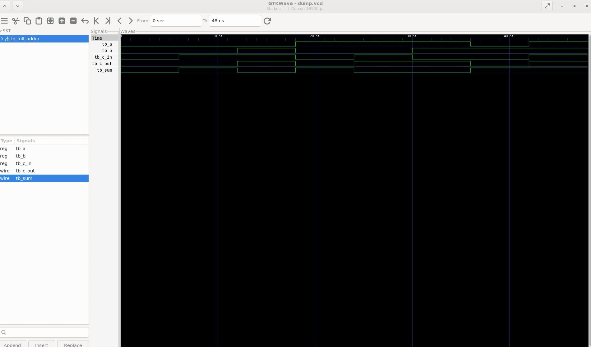
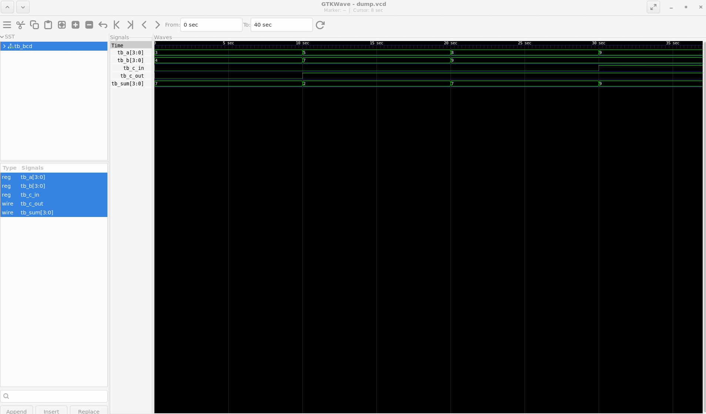
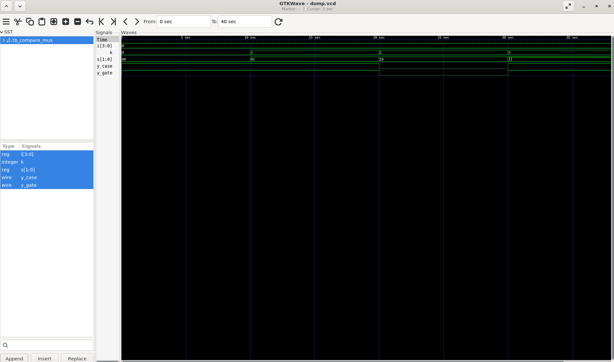

# Digital Logic Design in Verilog

RTL designs and testbenches for fundamental digital logic modules, simulated using Icarus Verilog and verified visually using GTKWave.

## Tools Used
- **Icarus Verilog** — RTL simulation
- **GTKWave** — waveform analysis
- **WSL2 (Ubuntu)** — development environment

## Modules

| Module | Description | Folder |
|---|---|---|
| Full Adder | 1-bit full adder with carry-in/out | [`full_adder/`](full_adder) |
| Ripple Carry Adder | Multi-bit adder built from full adders | [`ripple_carry_adder/`](ripple_carry_adder) |
| BCD Converter | Binary to BCD conversion logic | [`bcd_converter/`](bcd_converter) |
| 2-bit Comparator | Compares two 2-bit inputs | [`two_bit_comparator/`](two_bit_comparator) |
| 4-to-1 Multiplexer | 4-input mux with 2-bit select line | [`four_to_one_mux/`](four_to_one_mux) |
| D Flip-Flop | Edge-triggered 1-bit memory element with async reset | [`dff/`](dff) |
| 4-bit Counter | Synchronous up-counter with async reset, self-checking verification | [`counter/`](counter) |
| Ripple Carry Adder (generate-block) | Scalable adder built via genvar/generate loop, verified equivalent to manual version | [`ripple_carry_adder_generate/`](ripple_carry_adder_generate) |
| For-Loop Demo | Exhaustive procedural for-loop test of a 3-input combinational function | [`fundamentals_for_loop/`](fundamentals_for_loop) |
| For-Loop Demo | Exhaustive procedural for-loop test of a 3-input combinational function, with a task-based refactor (tb_for_loop_demo_task.v) proving identical results | [`fundamentals_for_loop/`](fundamentals_for_loop) |

## How to Run
```bash
iverilog -o sim design.v tb_design.v
vvp sim
gtkwave dump.vcd
```

---
## Example Waveforms

**Full Adder**


**BCD Converter (binary-to-BCD, self-checking testbench)**


**4-to-1 Mux — Structural vs Behavioral Equivalence Check**


---
Sequential logic now includes a fully verified D flip-flop and a self-checking 4-bit synchronous counter (independently-tracked expected value, wraparound verified). FSMs are next. Python/cocotb-based verification is planned further ahead.

